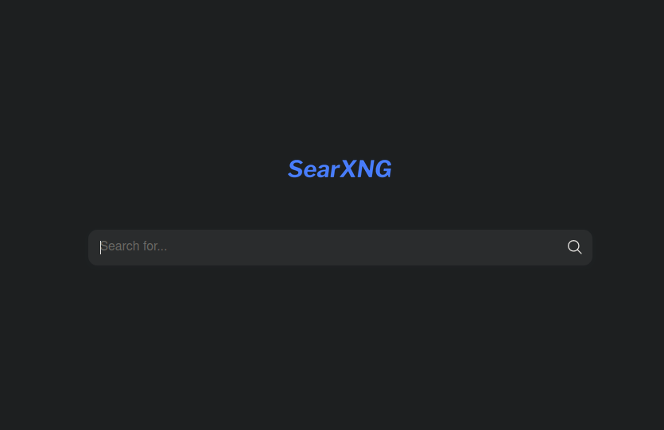
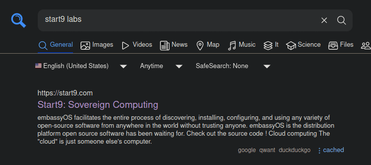

# Welcome to SearXNG!

A Privacy-respecting, hackable metasearch engine.

SearXNG is a free internet metasearch engine which aggregates results from more than 70 search services. 
By running your own SearXNG instance on embassyOS, you are neither tracked nor profiled. 

Additionally, SearXNG can be used over Tor for online anonymity.

SearXNG protects your privacy in three ways:
1. removal of private data from requests going to search services
2. not forwarding anything from a third party services through search services (e.g. advertisement)
3. removal of private data from requests going to the result pages

You can read more about how SearXNG protects your privacy when [running your own instance on SearXNG](https://docs.searxng.org/own-instance.html)

## Usage Instructions

Open SearXNG by using the `LAUNCH UI` button and you can begin searching right away.
In the top right corner there is a `Preferences` button, where you have several options to customize (or 'hack') the functionality and theme of your search engine.

## Configure SearX with Firefox

If you use Firefox as your internet browser, you have the ability to run a search query directly from the address bar of the browser. In Firefox settings you can choose with default search engine to use, e.g DuckDuckGO or Google. 

Alternatively, you can follow the instructions below to configure Firefox to use your own self-hosted SearXNG search engine to perform these queries.

1. Visit your SearXNG instance's web UI.

<!-- MD_PACKER_INLINE BEGIN -->

<!-- MD_PACKER_INLINE END -->

1. Right-Click on the search box in the middle of the page and select "Add a Keyword for this Search."
    
<!-- MD_PACKER_INLINE BEGIN -->

<!-- MD_PACKER_INLINE END -->

1. In the resulting box, enter a name (optional) and the keyword to use when you want to search in that site, then click "Save."
    - In this example, we use "se" as a keyword (it can be anything, but shorter is more convenient).
    
<!-- MD_PACKER_INLINE BEGIN -->

<!-- MD_PACKER_INLINE END -->

1. Now anytime you want to search your SearX instance, simply type your keyword at the beginning of a search query in the URL bar of Firefox
    
<!-- MD_PACKER_INLINE BEGIN -->

<!-- MD_PACKER_INLINE END -->

    That's it!  Your results page will pull up and you can continue to interact with the search from here.
    
<!-- MD_PACKER_INLINE BEGIN -->

<!-- MD_PACKER_INLINE END -->

If you are an advanced user, SearXNG has many additional features that have not been mentioned here.
For more information on how to use this search engine, please visit their [documentation webpage](https://docs.searxng.org).
