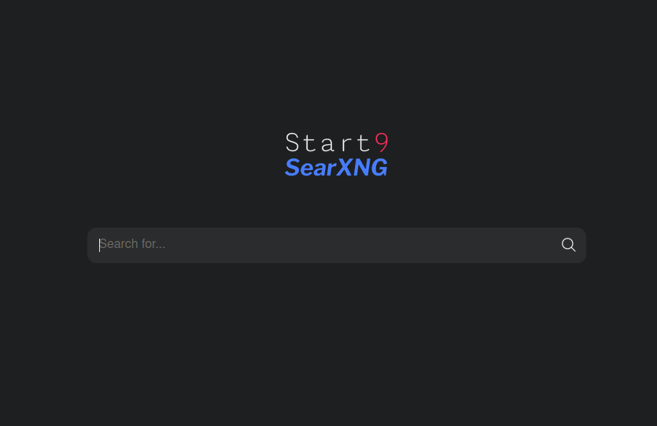
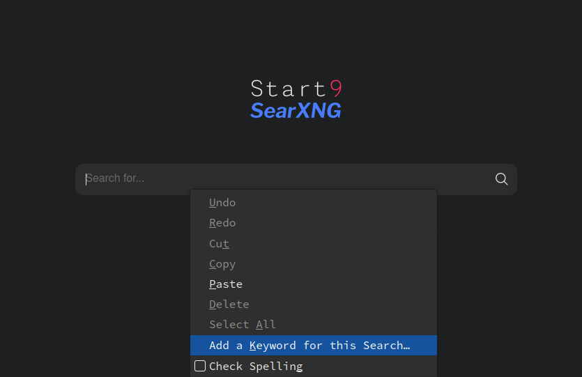
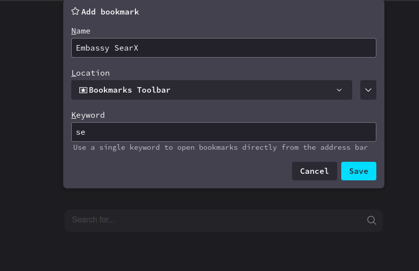
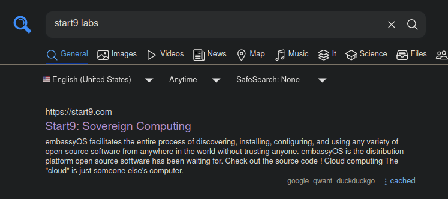

# Welcome to SearXNG!
A Privacy-respecting, hackable metasearch engine.
## Usage Instructions
Open SearXNG by using the `LAUNCH UI` button and you can begin searching right away.

## Configure SearX with Firefox
1. Visit your SearX instance's web UI.

<!-- MD_PACKER_INLINE BEGIN -->
    
<!-- MD_PACKER_INLINE END -->

1. Right-Click on the search box in the middle of the page and select "Add a Keyword for this Search."
    
<!-- MD_PACKER_INLINE BEGIN -->
    
<!-- MD_PACKER_INLINE END -->

1. In the resulting box, enter a name (optional) and the keyword to use when you want to search in that site, then click "Save."
    - In this example, we use "se" as a keyword (it can be anything, but shorter is more convenient).
    
<!-- MD_PACKER_INLINE BEGIN -->
    
<!-- MD_PACKER_INLINE END -->

1. Now anytime you want to search your SearX instance, simply type your keyword at the beginning of a search query in the URL bar of Firefox
    
<!-- MD_PACKER_INLINE BEGIN -->
    
<!-- MD_PACKER_INLINE END -->

    That's it!  Your results page will pull up and you can continue to interact with the search from here.
    
<!-- MD_PACKER_INLINE BEGIN -->
    
<!-- MD_PACKER_INLINE END -->
