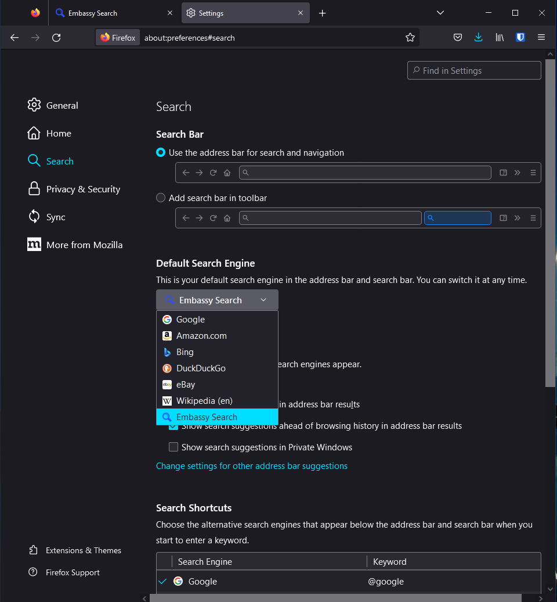
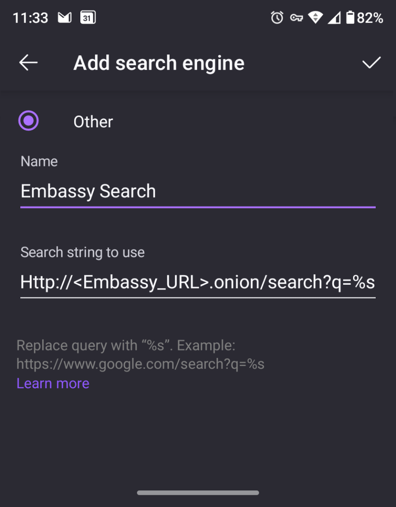

# SearXNG Setup Guides
## Set SearX as Default Search in Browser (Desktop)
1. Navigate to your Search page UI from the StartOS services dashboard
1. At the top of the browser Right Click on your SearXNG url
1. At the bottom of the drop down Click Add "My SearXNG"
1. Then using the Hamburger menu in the top right go to Settings > Search
1. Under the Default Search Engine heading Click on the drop down and select My SearXNG 
    
    

## Set SearX as Default Search in Browser (Mobile)
1. Go to Settings > Search > Then Click "Add Search Engine"
1. Add the Name you would like to use, such as My SearXNG, and then enter your .onion url
1. At the tail end of you .onion address add [ /search?q=%s ]
    
    

| Credit to Andy B for making this guide - thank you!